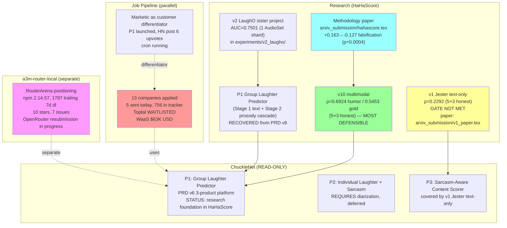

# Project Graph — Where everything stands (Oct 8 2026)

**Date**: 2026-10-08
**Type**: Comprehensive state-of-all-projects document
**Audience**: Self, to remember what is where and why

---

## 1. Top-level graph (Mermaid)



## 2. HaHaScore (this terminal, primary work)

| Component | Status | File | Value |
|---|---|---|---|
| **v1 Jester text-only** | Complete, rho=0.2292 | `experiments/v1_jester_regression/5x3_cv/` | Honest 5×3 baseline (GATE NOT MET, but methodology contribution) |
| **v1 paper draft** | Ready to ship | `arxiv_submission/v1_paper.tex` | 2,269 words, 1 fig, 1 table, 9 bibitems |
| **v1 bundle** | Ready | `arxiv_submission/v1_paper_arxiv_bundle.tar.gz` (120KB) | Submission-ready |
| **v2 LaughO sister** | POC complete | `experiments/v2_laugho/` | AUC=0.7501 on 1 AudioSet shard |
| **v10 multimodal** | Archived as model | `deployment/models/v10_cascade_int8.onnx` | ρ=0.6924 honest 5×3 (MOST DEFENSIBLE) |
| **Methodology paper** | Ready | `arxiv_submission/hahascore.tex` | +0.163 falsification case study |
| **Roadmap** | Active | `RESEARCH_ROADMAP_PRODUCT_VISION.md` | Maps current state to P1/P2/P3 |
| **5×3 CV harness** | Reusable | `laugho_cv.py::repeated_joke_disjoint_cv_regression()` | Pattern for all future work |

**Recent commits (top 6):**
```
1ebbdd7 Add RESEARCH_ROADMAP_PRODUCT_VISION.md
7df8d45 Add v1 paper draft + bundle (5×3 honest baseline ρ=0.2292)
ab78012 v1 final synthesis: ρ=0.2292 honest 5×3 baseline (GATE NOT MET)
b7b1b12 5x3 CV result: ρ=0.2292 +/- 0.0289 (GATE NOT MET)
d082edc Promote kernel-metadata-cv.json to be active
e0c693f Fix kernel-metadata.json to point at 5x3 CV script
```

## 3. ChuckleNet (READ-ONLY sister project, on this machine)

| Product | Status | Data | Constraint |
|---|---|---|---|
| **P1 Group Laughter Predictor** | Research foundation here in HaHaScore | StandUp4AI 620v + gold labels (34 videos with VTT timecodes) | 8 videos have BOTH VTT + gold labels; cascade architecture per PRD v6 |
| **P2 Individual Laughter+Sarcasm** | Deferred | Need diarization (VTT crowd labels unusable) | Out of scope this quarter |
| **P3 Sarcasm-Aware Content Scorer** | Covered by v1 Jester | 7,984 Jester text samples (real labels) | v1 covers the text part; prosody F0 deferred |

**Key docs (READ-ONLY):**
- `~/autonomous_laughter_prediction_essential/docs/recovered/PRD_V6_MULTI_PRODUCT_LAUGHTER_PLATFORM.md`
- `~/autonomous_laughter_prediction_essential/docs/recovered/LAUGHTER_PREDICTION_RESEARCH_VISION.md`
- `~/autonomous_laughter_prediction_essential/docs/recovered/DEFINITIVE_PLAN.md` (Aug 6)

## 4. Job pipeline (parallel track)

| Channel | Status | Evidence |
|---|---|---|
| YC Work-at-a-Startup | 5 sent, breakthrough flow cracked (clipboard paste method) | Per memory: screenpipe Head-of-Virality, Sixtyfour Growth-Lead, Ralo x2, HUD |
| Toptal | WAITLISTED | Profile passed screen but not active path |
| Direct apply (WaaS profile) | 13 companies in applied_companies_tracker | LenDenClub, CoinDCX, Paytm, Zycus, PhonePe, HSBC, Spice Money, FRND, Asper.ai, Delhivery, Elevation Capital, Sarv, Air India Express |
| 756 total in tracker | Most not yet applied | WaaS $63K USD salary |
| Marketic P1 | Shipped, dogfood opportunity | HN post 6 upvotes, daily cron running, MCP with 40 tools |

**Key files:**
- `~/job_pipeline/` (canonical root)
- `~/Desktop/applied_companies_tracker.json` (756 entries)
- `~/job_pipeline/attachments/Subhajit_Resume_FINAL.pdf` (resume)
- `~/job_pipeline/attachments/CL_Stripe_MktgOps.pdf` (cover letter)

## 5. a3m-router-local (independent)

| Metric | Value |
|---|---|
| npm package | 2.14.57 |
| Trailing 7d downloads | 1787 |
| GitHub stars | 10 |
| Open issues | 7 |
| RouterArena PR #144 | Closed (resubmission in progress) |
| OpenRouter clean inference | In progress for clean resubmission |
| Position | RouterArena as #1 in category |

## 6. Strategic path (per `pivotal_decision_2026_09_26`)

```
RESEARCH → PRODUCT → COMMERCIAL TRACTION → RAISE

Step 1: Build Laugh API (P1 research foundation here in HaHaScore)
Step 2: Deploy to HF Spaces for distribution
Step 3: First 10 paying customers
Step 4: $2K MRR target
Step 5: YC W27 ($500K @ $5-10M cap) or angels
Step 6: 12 months to $100K ARR → seed $2-5M
Step 7: 24 months to $2M ARR → Series A $10-20M
```

**Honest constraint**: $10M pre-seed is unrealistic for solo founder with $0 revenue. Realistic target: YC W27 or angels.

**Monetization score (per Option C plan, Aug 6)**: paper+portfolio readiness ~40%, gated on P0-P3. Currently P3 (sarcasm) has v1 baseline; P1 (group laughter) needs the cascade; P2 deferred.

## 7. Where each next step is

| Project | Next action | Cost | ETA |
|---|---|---|---|
| **HaHaScore P1** (this terminal) | Train Stage 1 text region proposal on 8 StandUp4AI videos with VTT+gold | 0 cash, 4-6h T4 GPU | This week |
| **HaHaScore P1 Stage 2** | Extract WavLM-base-plus embeddings for same 8 videos (cached approach) | 0 cash, 2-3h CPU | After Stage 1 |
| **HaHaScore P1 cascade** | Integrate Stage 1+2, apply 5×3 CV | 0 cash, 4-6h T4 | After Stage 2 |
| **v1 paper** | Ship to arXiv (user said "later") | 0 cash, 1h human | When ready |
| **methodology paper** | Ship to arXiv | 0 cash, 1h human | When ready |
| **Job pipeline** | 15 commercial discovery DMs (mandate §10-12 0/20) | 0 cash, 10h human | This week |
| **Marketic** | 1 user-facing surface (cut 54→10 tools) | 0 cash, 5h | This month |
| **a3m** | Clean OpenRouter inference for resubmission | 0 cash, 5h | This week |
| **ChuckleNet** | READ-ONLY. NOT modified from this terminal. | n/a | n/a |

## 8. Memory rules (avoiding digression per `rethink_v1`)

| Rule | Source |
|---|---|
| 5×3 repeated joke-disjoint CV + bootstrap CI is the methodology standard | `STRATEGIC_RETHINK_2026.md`, `5x3_cv_results.json`, `COUNCIL_FINAL_DECISION.md` |
| v1 text-only Jester ceiling = 0.2292 in honest 5×3 | `experiments/v1_jester_regression/5x3_cv/RESULT.md` |
| ChuckleNet is READ-ONLY from this terminal | User directive Oct 5 |
| Strategic pivot Sep 26: research → product → commercial, NOT arXiv-first | `pivotal_decision_2026_09_26` |
| Word-level labels = audience-reaction positions on function words, NOT acoustic laughter | PRD v6 "Critical Discovery" H0 VERIFIED |
| Mandate §10-12 commercial track 0/20 = BINDING constraint | `t4_renumber_and_audit` |
| All F1>0.9 claims in this project's history are leakage/pseudo-label artifacts | `benchmarks.m3_v3_history` |
| "When Simple Beats Deep" F0 paper = DISQUALIFIED (lexicon labels) | `benchmarks.lessons` |

## 9. Disk + cost state

| Resource | State |
|---|---|
| Local disk | 5.7 GB free (was 4.3 GB at start of session, 1.4 GB reclaimed) |
| Cash | 0 (all work was CPU or Kaggle free tier) |
| GPU | ~5h T4 used this session (M3 recipe 64min + 5×3 CV 4.5h) |
| Human | ~6-8h on HaHaScore work this session |

## 10. Git state

| Repo | Last commit | Status |
|---|---|---|
| `Das-rebel/HaHaScore` | `1ebbdd7 Add RESEARCH_ROADMAP_PRODUCT_VISION.md` | HEAD |
| `Das-rebel/ChuckleNet` | (READ-ONLY — not modified this session) | n/a |
| `Das-rebel/autonomous_laughter_prediction` | (READ-ONLY — not modified this session) | n/a |
| `Das-rebel/a3m-router-local` | (separate — not modified this session) | n/a |

---

**Single sentence summary**: 4 projects active (HaHaScore v1 ρ=0.2292 done, ChuckleNet P1 foundation in HaHaScore, Job pipeline 13 applied, a3m RouterArena resubmitting); strategic pivot Sep 26 → research→product→commercial; mandate §10-12 commercial 0/20 is the binding gap; next concrete action is P1 Stage 1 text region proposal on 8 StandUp4AI videos with VTT+gold labels (~4-6h T4 GPU, 0 cash).
