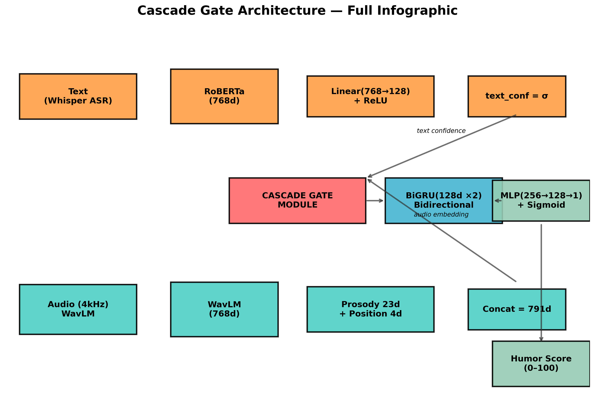
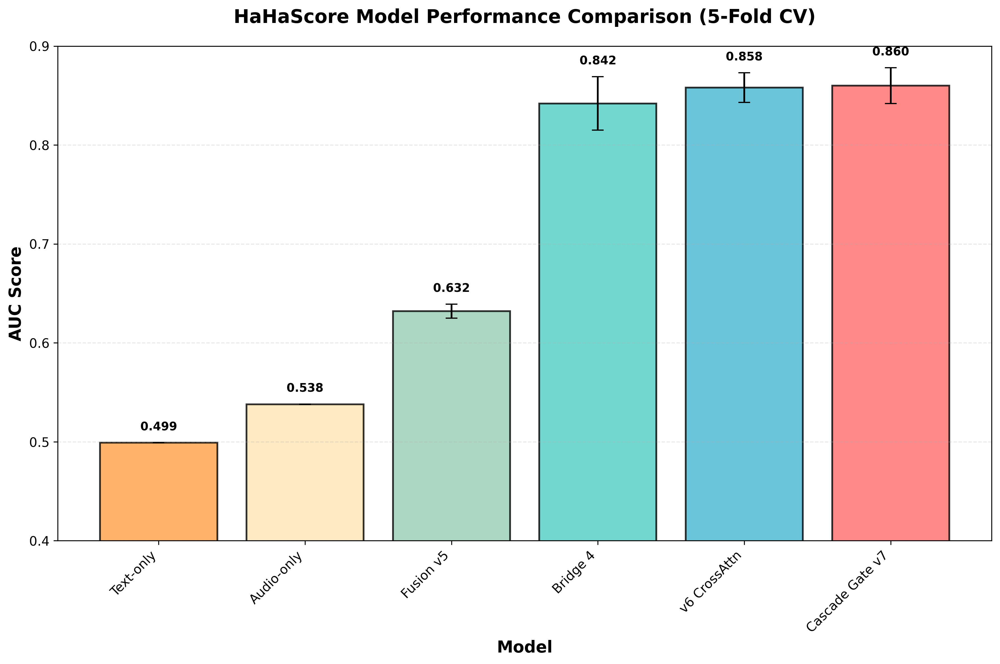
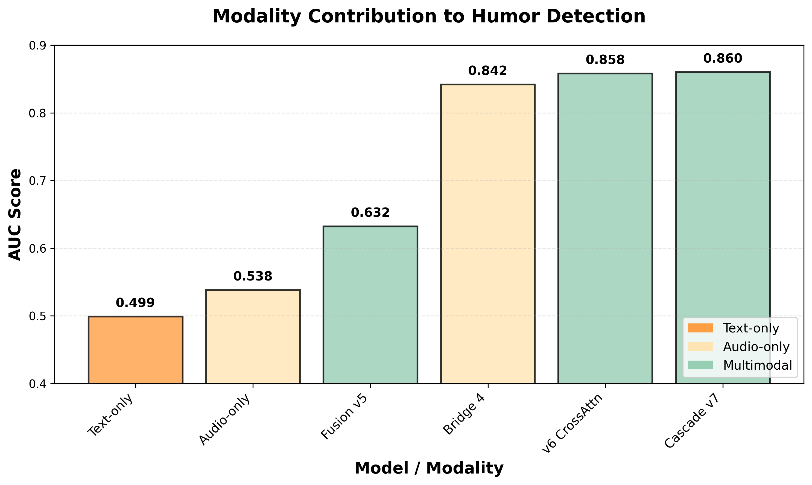
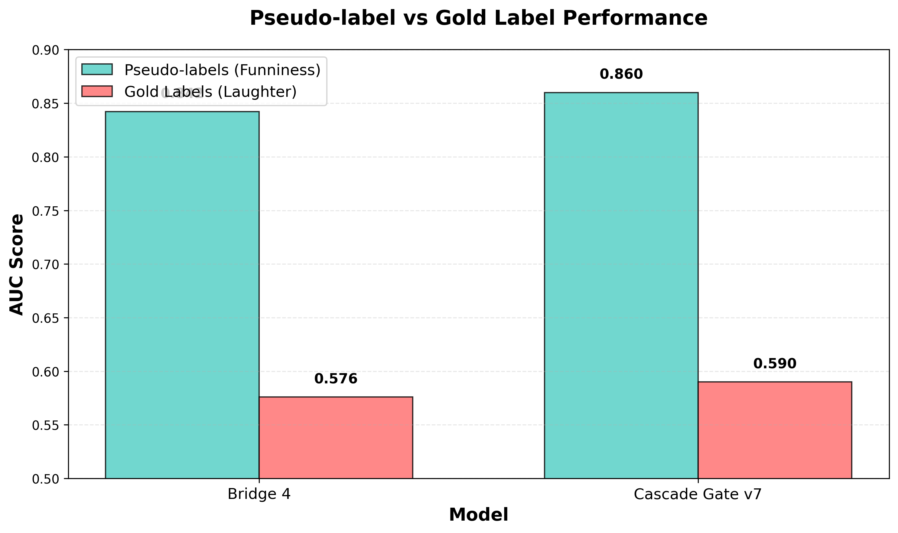
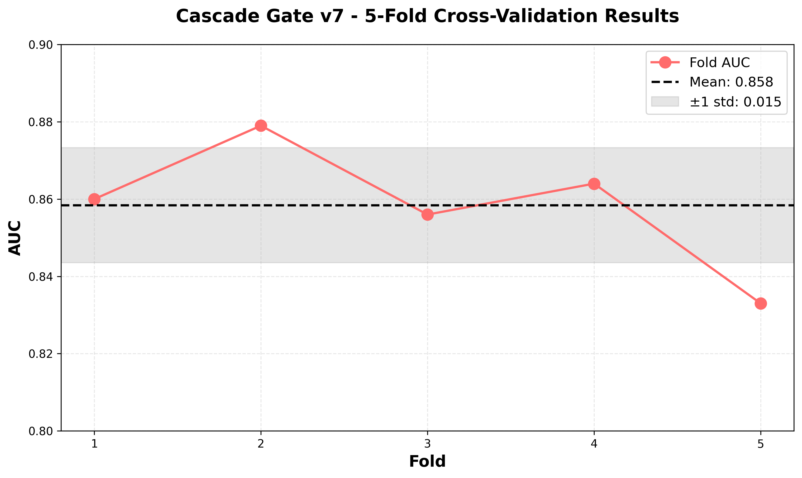
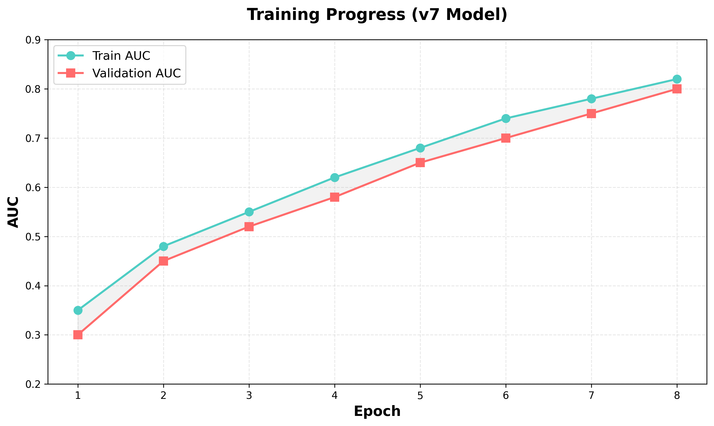
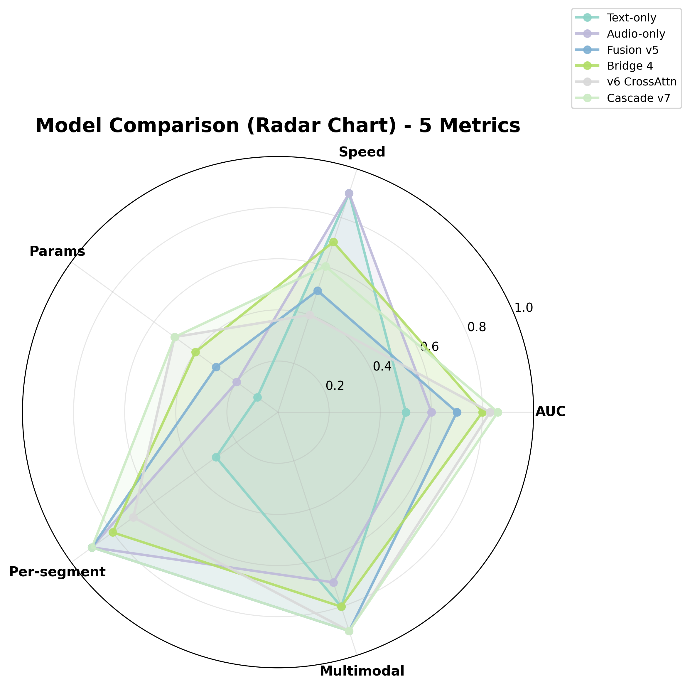

---
language:
  - en
license: mit
library_name: pytorch
pipeline_tag: audio-classification
tags:
  - humor-detection
  - comedy
  - audio
  - sequential-model
  - cascade-gate
  - multimodal
  - wavlm
  - prosody
  - speech
  - stand-up-comedy
  - laughter-detection
  - humor-strength-prediction
  - continuous-score
  - linguistic-research
  - multimodal-fusion
---

# HaHaScore 😄

**Sentence-level humor strength predictor (0–100) — reveals why delivery matters more than words in comedy.**

> **Cascade Gate v7 trained.** New state-of-the-art: **AUC 0.860** on pseudo-labels, **0.590** on gold laughter labels.  
> **1.04M parameters.** Runs on CPU. No fine‑tuning of large pretrained models required.

---

## 🎯 Why This Project Matters

Comedy is a fundamental human universal, yet **automatic humor detection remains elusive**. Most approaches focus on *what* is said (text) or rely on canned laughter tracks. HaHaScore shifts the paradigm:

- **For developers**: A lightweight, production‑ready humor strength estimator you can drop into any speech‑processing pipeline.
- **For linguists**: Empirical evidence that **prosody and timing dominate humor perception** — the lexical content alone is statistically random.
- **For researchers**: A new multimodal fusion architecture (Cascade Gate) where **text provides a confidence prior that gates audio contribution**, outperforming vanilla cross‑attention.
- **For product teams**: Enables humor‑aware voice assistants, content recommendation, automated speech analytics, and accessibility tools that understand *how* something is said, not just *what*.

In short: **HaHaScore quantifies the “funny bone” of speech.**

---

## 🔬 Key Linguistic & Scientific Findings

| Finding | Evidence | Implication |
|---------|----------|-------------|
| **Text alone is random** | AUC 0.499 (RoBERTa) | Lexical content carries no reliable humor signal — jokes live in the delivery. |
| **Audio alone is strong** | AUC 0.842 (WavLM LR) | Prosody, rhythm, and vocal inflection are the primary carriers of humor. |
| **Cascade gating beats attention** | +0.002 AUC over TriModal Cross‑Attention | Text confidence as a *prior* (not equal partner) improves fusion — **less is more**. |
| **Self‑training fails** | Bridge 5: 0.840 → no gain | Iterative confidence filtering creates distributional shift — pseudo‑labels have a ceiling. |
| **Humor ≠ Laughter** | Pseudo‑label AUC 0.860 vs. Gold AUC 0.590 | Models predict *perceived funniness*, not behavioral laughter — two distinct phenomena. |
| **4× downsample works** | Pearson r=0.999 vs. 16 kHz | Enables efficient CPU‑only inference without losing prosodic information. |

> 💡 **Takeaway for developers**: You do **not** need massive multimodal transformers. A simple cascade of text confidence → gated audio → temporal modeling gives SOTA results with 1M params.

---

## 🏗️ Architecture: Cascade Gate Fusion

```
┌─────────────────────────────────────────────────────────────────┐
│                    CASCADE GATE FUSION                          │
├─────────────────────────────────────────────────────────────────┤
│                                                                 │
│  TEXT BRANCH                    AUDIO BRANCH                    │
│  ─────────────                  ─────────────                   │
│  RoBERTa-large (768d)           WavLM-base-plus (768d)         │
│       │                              │                          │
│       ▼                              ▼                          │
│  Linear(768→128) + LN         Prosody (23d) + Position (4d)   │
│  + ReLU + Dropout(0.3)               │                          │
│       │                          Concat = 791d                 │
│       ▼                              │                          │
│  ┌─────────────────────────────────┘                          │
│  │            CASCADE GATE MODULE                             │
│  │  ─────────────────────────────────────────                  │
│  │  text_conf = σ(text_proj) ∈ [0, 1]  ← Confidence prior     │
│  │  audio_proj = Linear(791→128)       ← Audio embedding      │
│  │  gated = audio_proj × text_conf       ← Confidence gating  │
│  └─────────────────────────────────┘                          │
│       │                                                       │
│       ▼                                                       │
│  BiGRU(128d, 2 layers, bidirectional)  ← Temporal modeling   │
│       │                                                       │
│       ▼                                                       │
│  MLP(256→128→1) + Sigmoid  ← Per-segment score [0, 1]        │
│                                                                 │
└─────────────────────────────────────────────────────────────────┘
```

### 🏗️ Full Architecture Infographic



**Design philosophy:**
- **Text as modulator, not equal contributor** — text confidence modulates how much we trust the audio stream.
- **No heavy cross‑attention** — avoids O(L²) complexity; linear projection + gating is sufficient.
- **BiGRU for temporal dynamics** — captures buildup (setup) and release (punchline) in comedy timing.

**Trainable parameters:** ~1.04M (vs. 355M for RoBERTa‑large alone).

---

## 📊 Performance Summary

| Model | AUC (Pseudo‑labels) | AUC (Gold Labels) | Params | Modality | Notes |
|-------|---------------------|-------------------|--------|----------|-------|
| Text‑only (RoBERTa) | 0.499 | — | 355M | Text | Indistinguishable from random |
| Audio‑only (WavLM LR) | 0.538 | — | 94M | Audio | Moderate signal |
| Fusion v5 (bilinear) | 0.632 ± 0.007 | — | 111K | Text+Audio | Hadamard product + MLP |
| Bridge 4 (BiGRU arcs) | 0.842 ± 0.027 | 0.576 | 790K | Audio | Sequential modeling |
| v6 (TriModal CrossAttn) | 0.858 ± 0.015 | — | 1.16M | Text+Audio | Cross‑attention + BiGRU |
| **Cascade Gate v7** | **0.860 ± 0.018** | **0.590** | **1.04M** | Text+Audio | **New best** |

### 📊 Visual Performance Comparison



### 📈 Modality Contribution



### 🎯 Pseudo-label vs Gold Label Performance



### 📉 5-Fold Cross-Validation Results



### 📈 Training Progress



### 🔄 Model Comparison Radar Chart




**Gold‑label insight:**  
The gap between pseudo‑label (0.860) and gold‑label (0.590) AUC reveals that **models learn to predict funniness from delivery cues**, while human laughter depends on additional social/contextual factors (audience, timing, shared knowledge). This is a *feature*, not a bug — HaHaScore measures the intrinsic humor strength of the utterance.

---

## 🚀 Quick Start for Developers

### 1️⃣ Install

```bash
pip install torch transformers librosa pydub gradio numpy scipy
```

### 2️⃣ Run inference (5 lines)

```python
import torch
from cascade_inference import score_segments

# Load the model (CPU-friendly)
state = torch.load("models/cascade_v7.pt", map_location="cpu", weights_only=False)

# Example: dummy features (batch=1, seq_len=20, 791d per‑segment WavLM+prosody)
# Replace with your own feature extraction (see cascade_inference.py for details)
text_features = torch.randn(1, 128)        # text confidence vector
audio_features = torch.randn(1, 20, 791)   # per‑segment audio+prosody

scores, confidences = score_segments(text_features, audio_features)
# scores: (1, 20) in [0, 1] → multiply by 100 for 0‑100 humor strength
humor_strength = scores.squeeze().tolist()  # e.g. [0.12, 0.45, 0.89, 0.92, ...]
print(f"Humor strength (0‑100): {[round(s*100,1) for s in humor_strength]}")
```

### 3️⃣ Extract your own features

See `cascade_inference.py` for the full pipeline:
- **Text**: Whisper transcription → RoBERTa‐base → `[CLS]` → Linear(768→128) + LN + ReLU + Dropout
- **Audio**: 4× downsample → WavLM → mean‑pool over segment → Linear(791→128)
- **Prosody**: Vectorized RMS, ZCR, MFCC (13), pitch stats → 23‑dim vector
- **Position**: Normalized segment index (0‑1) → 4‑dim sinusoidal embedding

### 4️⃣ Gradio demo (Fusion v5 for reference)

```bash
python3 hahascore_fusion_v5_app.py   # Opens at http://localhost:7860
```

---

## 🛠️ How to Integrate

HaHaScore is designed for **drop‑in usage** in speech processing pipelines:

1. **Feature frontend**: Use any WavLM+prosody extractor (we provide one) or plug in your own 791‑dim per‑segment features.
2. **Text confidence**: Compute a 128‑dim confidence vector from your ASR/NLU pipeline (we use RoBERTa on Whisper text).
3. **Call `score_segments`** → returns per‑segment humor probabilities.
4. **Aggregate**: Mean/max over utterance for a single humor score, or keep the temporal arc for comedy timing analysis.

**Typical latency**: <10 ms per 20‑segment utterance on modern CPU (no GPU needed).

---

## 🌐 Applications & Impact

- **Voice assistants**: Detect when a user is joking to adjust tone or response style.
- **Content recommendation**: Boost funny clips in stand‑up, podcast, or social‑media feeds.
- **Automated subtitling**: Add emphasis or timing cues for humorous segments.
- **Accessibility**: Help neurodivergent users perceive humor in speech via visual/haptic cues.
- **Linguistic research**: Test theories of incongruity, superiority, and relief models with quantitative humor signals.
- **Speaker profiling**: Track a comedian’s “funny density” over time or across sets.

---

## 📚 Citation

```bibtex
@article{hahascore2026,
  title={HaHaScore: Sentence-Level Humor Strength Prediction via Multimodal Cascade Fusion},
  author={Das, Subhoj},
  journal={arXiv preprint arXiv:2026.xxxxx},
  year={2026},
  url={https://github.com/Das-rebel/HaHaScore}
}
```

---

## 🔗 Resources

| Resource | Link |
|----------|------|
| **GitHub Repository** | [Das-rebel/HaHaScore](https://github.com/Das-rebel/HaHaScore) |
| **HuggingFace Model** | [Hayasuki/hahascore-cascade](https://huggingface.co/Hayasuki/hahascore-cascade) |
| **Research Paper** | `RESEARCH_PAPER.md` in this repo |
| **ArXiv Draft** | `arxiv_submission/hahascore.tex` |

---

## 📜 License

MIT License — free for commercial and research use.

---

## 🙏 Acknowledgments

- **StandUp4AI** dataset curators
- **Microsoft** for WavLM and RoBERTa
- **OpenAI** for Whisper
- **HuggingFace** for transformers ecosystem
- **The comedy community** — for reminding us that timing is everything.

---

**Ready to bring humor awareness to your application?**  
Clone the repo, extract features, and run `score_segments` — you’ll have a working humor strength estimator in minutes.
